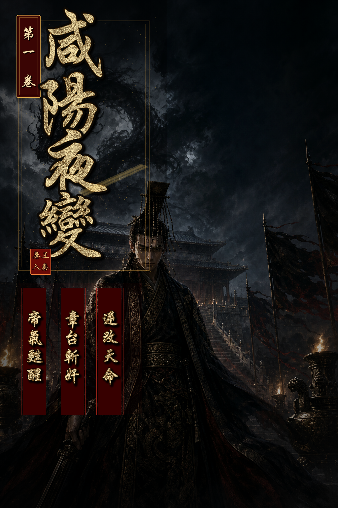

第1卷｜第1章

# 第一章：含風殘夢

上一章：無 | [下一章](./第1卷_第2章_黑龍困宮.md)

含風殿最後那夜，藥氣濃得像霧。

李世民半臥榻上，耳邊聽見的是鼎中藥滾，是內侍壓得極低的腳步，也是殿外群臣不敢亂動的衣甲摩擦聲。人到將死時，許多事反而想得極清楚。玄武門那一箭、渭水橋那一次低頭、魏徵那一張總不肯順他的嘴、長孫皇后臨終時看他的眼神，竟都在這時候一件件浮上來。

還有兩道不肯入正史的影子。

一人姓寇，曾自揚州泥濘裡翻身，以少帥之名裂土爭雄，最後卻把能坐天下的刀意交還天下；一人姓徐，白衣渡江，守著玄門奇書與慈航清影之間的一點清明，像一柄不肯沾王氣的劍。他們不是臣，也不是賊，卻讓李世民明白過，天下從來不只在金殿與軍陣裡決定，江湖也有自己的龍。

江山打到手裡，原來也不能替人擋死。

他知道自己該閉眼了。

* * *

可他閉眼之後，先聽見的卻不是陰司鬼鼓，而是極細的一聲風鈴。

那風鈴冷得很，不像大唐宮簷下的玉，倒像鐵，像骨，像有人把一截凍裂的夜敲進他耳朵裡。

李世民沒有立刻睜眼。

他先覺得不對。

身體太輕。手也太輕。不是一個將死老人該有的沉鈍，反倒像一頭還能縱欲、還能疑神疑鬼、也還能被人牽著鼻子走的年輕身體。

* * *

他猛地張眼。

黑帳垂地，殿柱如鐵，燈火是深黃的，像一座還沒封土的陵寢。案上竹簡堆著，最上頭攤開的一卷帛書只寫了八個字。

關東盜起，宜盡誅之。

李世民只看了一眼，腦中便像有一座水閘轟然崩開。

沙丘。密詔。扶蘇。蒙恬。李斯。趙高。大澤鄉。陳勝。吳廣。

* * *

一段並不屬於他的記憶，帶著驚惶、荒淫、猜忌與殘忍，硬生生灌進他四肢百骸。那不是讀史的冷知識，而是另一個人的舌根、胃囊、血氣與惡夢。李世民幾乎當場作嘔。

他明白了。

自己不是夢回前朝。

自己是進了胡亥的身。

他坐起身時，胸口忽然一冷。

* * *

那冷意不是病，而是一股盤在心脈上的陰柔真氣，黑得像浸了毒的蛛絲，沿著這具身體的經絡細細遊走。它不剛猛，卻最會鉤人疑心、放人大欲，像一隻手，年深日久地替這位二世皇帝換了心腸。

李世民眼神沉了下去。

趙高。

這念頭一起，心脈間那股陰氣竟像聽見主人喚名似的，微不可察地顫了一下。

* * *

可在那陰氣更深處，還另有一物。

那是一股極沉、極古、幾乎快被污泥與血怨壓死的龍氣，蟄在丹田底，像一條被鐵鏈困住的黑龍。它不信任這具身體，也不肯信任任何人，可當李世民的神意落下去時，那黑龍竟緩緩睜了一次眼。

只一眼，整座宮殿的燈火都暗了暗。

殿門外，有人報。

「中車府令趙高，請見陛下。」

* * *

李世民慢慢把手按在案角上，像是在按住一個帝王剛從死裡爬回來的第一口氣。

「宣。」

門開。

趙高走得很穩，衣袍齊整，臉上那種溫恭與悲憂，恰到好處得像量過。他先伏地，再抬頭，聲音柔得近乎謙卑。

「關東盜起，群情未定。臣斗膽，請陛下早下嚴詔，以安天下。」

* * *

李世民看著他。

旁人若只看言語，多半會以為這是一個憂國的近臣。可真正在場中牽住先手的，不是這句話，而是趙高跪地時雙肩那一點若有若無的前傾，是袖中五指藏著的鬆緊，是他看皇帝時刻意收住的那半口氣。

他不是來請旨。

他是來看，今夜這個皇帝，還是不是昨日那條被他拴著走的狗。

李世民沒有立刻答。

* * *

他只低下眼，看那卷「宜盡誅之」的帛書，像真在遲疑。

趙高便又向前半步。

「盜起於輕縱，亂生於姑息。若不先震天下，臣恐六國餘孽聞風並起。」

李世民忽然笑了。

那笑意很淡，淡得像一滴水落進一口古井裡。

* * *

「卿說得有理。」

趙高眸光微定。

「只是朕在想，天下若人人都逼到只能反，朕拿什麼守這個天下。」

趙高眼皮終於顫了一下。

很輕。

* * *

輕到滿殿旁人未必看得出來，但李世民看得很清楚。因為就在對方那一瞬失神時，心脈裡那條被趙高種下多年的陰線，也跟著微亂了一下。

他知道，自己找對人了。

趙高立刻俯首。

「陛下聖明。只是盜勢如火，朝廷不可無威。臣願與群臣共議，替陛下分憂。」

李世民淡淡道：「自然要議。」

* * *

他抬手，指尖在案上那柄黑鞘長劍旁輕點了一下。

「三日後，朕祭告先帝。」

「卿與百官，都來。」

趙高再拜：「臣遵旨。」

他退出去時，步子和進來時一樣穩。

* * *

殿門重新合上，風鈴又響。李世民望著那人背影消失在黑暗裡，才把手真正按上劍柄。

劍名定六合。

* * *

這一世，他不是來給胡亥補過的。

他是來和這個將亡的天下，一起跟天命算總帳的。

* * *

三日後，先斬趙高。

上一章：無 | [下一章](./第1卷_第2章_黑龍困宮.md)
