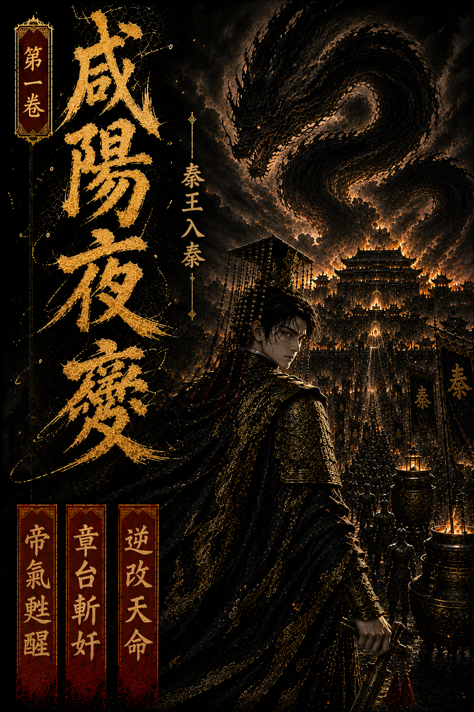

第1卷｜第1章

# 第一章：咸陽夜醒

上一章：無 | [下一章](./第1卷_第2章_黑龍困宮.md)

李世民醒來時，先聽見風鈴。

那聲音很輕，卻不空靈，像冷鐵碰在骨節上，一下一下，自黑夜深處敲進人心。它不像翠微宮含風殿簷下的玉鈴。那裡的風聲帶藥氣，帶衰朽，也帶一個老皇帝將盡未盡的命；而此處的風更冷，更硬，像從高闕、長廊、深宮夾道間一路灌進來，把人的魂都吹薄了一層。

他沒有立刻睜眼。

最後的記憶還停在貞觀二十三年五月二十六日的夜裡。

含風殿燈火昏黃，藥鼎微滾，內侍不敢高聲。群臣在殿外伏地，太子、諸王與后妃的影子被宮燈拉得很長。那一夜，他身上的骨頭像被歲月一寸寸磨空，連抬手都覺沉重。年少時策馬衝陣的力氣，渭水橋上壓住屈辱的心氣，貞觀朝堂上容人、斷人、鎮天下的帝王之勢，到那時都已像潮水退去，只剩下一具將崩的身體，與再也躲不開的生死。

他記得自己曾想起很多事。

想起玄武門。

想起長孫皇后。

想起魏徵諫他時那雙直得近乎刺人的眼。

想起高句麗未平，邊患未絕，想起晚年求藥問道時的荒唐與不甘。

一個做過開國帝王的人，到臨死時才最清楚地明白，江山再大，也填不滿生死這道口子。

可那本該是終點。

李世民緩緩睜眼。

映入眼中的，不是含風殿。

黑色帷帳垂落如夜，帳角繡玄鳥。殿柱高而沉，漆黑如鐵。四角宮燈罩著深黃火光，把殿中照得像一座未冷的陵寢。案上竹簡堆積，漆案邊緣還殘著新刮過的刀痕；几旁擱著一柄長劍，鞘身黝黑，古意森森。

這不是大唐。

李世民的瞳孔微微一縮。

他先看見自己的手。

那是一雙年輕的手，蒼白，修長，指節間還留著常年握筆、執劍與縱欲後的虛浮痕跡，卻絕不是一個垂死老人該有的手。

案上最上方有一卷展開的帛書，字意狠戾，筆勢尖刻。

「關東盜起，宜盡誅之。」

只七字，殺氣滿案。

李世民盯著那道未用璽的詔令，胸口忽然像被人重重捶了一記。

不是因為這道詔本身。

而是因為下一瞬，自他腦海深處湧上的，不再是大唐的宮燈與藥香，而是另一場更早、更黑、更腐敗的風暴。

沙丘。

密詔。

扶蘇。

蒙恬。

李斯。

胡亥。

趙高。

大澤鄉。

陳勝、吳廣。

陌生而劇烈的記憶像洪水倒灌，轟然衝進他的神魂。那不是讀史能讀來的冰冷文字，而是另一個人的驚惶、殘忍、放縱、疑忌與卑怯，一股腦兒塞進他胸腔與骨髓裡。李世民一瞬間幾乎想把整個胃都吐出來，因為他已清清楚楚地知道，自己不是做夢。

他成了胡亥。

而且不是剛即位、還未釀成大禍的胡亥。

是那個已經逼死扶蘇、迫死蒙恬、任趙高亂政、把天下逼到反旗四起、讓整個帝國從骨頭裡開始爛掉的秦二世。

李世民閉了閉眼，胸中第一個升起的念頭不是驚，不是怒，而是荒謬。

他一生都在與天命打交道。

少年時，天下說李唐未必能成，他偏要成。

玄武門前，兄弟血濺，世人說那是逆倫，他偏要以此路坐穩天下。

貞觀年間，四夷賓服，萬國來朝，他也曾以為自己摸到了所謂天命的形狀。

可到頭來，天命給他的答案，不是長生，不是安然駕崩，而是把他投進另一個將亡之朝，投進天下最臭名昭著的一具身體裡。

這不是恩賜。

像審判。

他正要撐身坐起，心脈間忽然一陣絞痛。

那痛來得極陰，極冷，不像病，更像活物。李世民內視經脈，只見胸口至泥丸之間，竟盤著一股細密陰毒的真氣，黑得像墨，又像蛛網，正順著這具身體的脈絡往來遊走。它不霸烈，卻滑膩陰柔，像蛇纏在君王心竅上，日積月累，把疑、怒、欲、懼一點點釀成習性。

李世民神色微沉。

這不是胡亥自己練出來的東西。

這是有人種進去的。

種了很多年，種到這皇帝的喜怒都不再真屬於自己，旁人只要一個眼神、一句勸言、一碗藥、一道詔，便能牽動他的心神。

趙高。

這名字在他心中一落，竟與那股陰氣生出呼應，像黑暗裡有人輕輕笑了一聲。

李世民剛欲強行鎮住它，丹田更深處卻又是一震。

那裡藏著另一股力量。

沉，重，冷，闊。

像是萬里關河壓成一線，六國城池化入一身，宗廟、律令、甲兵、郡縣與萬民血汗一層層壘起，最後在地下凝成了一條不肯死去的黑龍。

那是大秦帝氣。

只是這帝氣已污。

污於民怨，污於暴政，污於二世之惡，污於趙高陰符。

黑龍本該護國，如今卻被逼成了噬主之蟒。

李世民深深吸了一口氣。

前世今生，兩段皇權、兩股氣數、兩種帝王之路，在這一口氣裡猛然相撞。

他前世在玄武門後悟到帝王之殺。

在渭水橋上悟到帝王之忍。

在貞觀盛世裡悟到帝王之守。

如今這三重心境撞上大秦殘龍，竟在丹田深處撞出一絲前所未有的氣機。那氣機既非唐，也非秦，像是兩朝帝運在生死夾縫中重新鑄成的一道新刃。

李世民心神微震。

他幾乎不必命名，便知道了它該叫什麼。

《天策龍皇訣》。

就在這時，殿外傳來一聲細細的通報。

「陛下，趙府令求見。」

李世民眼底的光陡然一沉。

來得真快。

他才醒，趙高便到了。這已不是權臣耳目通達，而是把整座寢宮都養成了自己的手腳。

李世民下意識看向案上秦劍。

只要一劍。

這宮裡最該死的人就在門外。

可他的手指才碰上劍鞘，便又停住。

他不是莽夫。

更不是剛入亂世、憑一腔血勇便以為能翻盤的少年。

趙高敢深夜求見，意味著宮門、近侍、宿衛、詔令、藥餌、燈火，多半都已經在其掌中。若今夜在寢殿裡一劍殺了趙高，明日傳遍咸陽的，不會是皇帝誅奸，而是二世發狂。到時候詔令還是趙高的人寫，禁軍還是趙高的人調，甚至那柄殺趙高的劍，都可能在天亮前變成他自裁或弒臣失德的證物。

要殺此人，不能只靠劍。

還要靠名分，靠局。

李世民收回手，沉聲道：「宣。」

殿門緩緩打開。

先入的是風，後入的是人。

趙高身形瘦長，白面無鬚，步子輕得幾乎不帶聲。他穿著規整的內廷朝服，腰背微躬，看起來甚至有些老態龍鍾，像一個再尋常不過、只知奉命辦事的宦者。可李世民一眼便看見了那層偽裝下的東西。

趙高的氣機，像一張網。

不張牙，不舞爪，不帶戰場上的銳意與殺氣，卻從衣袖、眼角、呼吸與說話前那微不可察的一頓裡，細細密密地滲出來。那是一種能把人心一點點勒緊、再讓對方以為那念頭原本就出自自己的陰術。

「陛下。」

趙高伏地，姿態恭謹得近乎卑微。

李世民沒有叫起。

他只是坐著，看。

殿中一時極靜。

燭火不動，風鈴也停了。

趙高伏在地上，眼皮低垂，心中卻微微一凜。他侍奉胡亥多年，太清楚這位皇帝的氣。胡亥暴躁、縱欲、多疑，最受不得沉默，一旦旁人不順著哄，便會先亂。可今夜坐在高處的這個人，竟安靜得像一潭深水。

越安靜，越危險。

半晌，李世民才淡淡開口。

「趙府令深夜求見，所為何事？」

趙高這才抬頭，將早已備好的話緩緩奉上。

「關東盜賊蜂起，不過饑民與亡命之徒。臣以為，亂世當用重典。凡失城者族，逗留者斬，與盜通者夷三族。如此震懾天下，諸郡自然不敢再有二心。」

他說話時，聲音很柔，柔得像一碗溫藥。

可就是這份柔，讓李世民胸中那股黑蟒陰氣又蠢蠢欲動，彷彿這具身體早已習慣在這樣的聲音裡點頭，習慣讓別人替自己作惡，再把惡意誤認為君威。

李世民壓住那股衝動，反問道：「卿覺得，天下怕死的人多，還是不怕死的人多？」

趙高怔了一怔。

這不是胡亥會問的話。

他很快垂首道：「自然是怕死者多。」

「若法令使人活不得，怕死之人，會不會也變成不怕死的人？」

趙高袖中手指微不可察地一收。

他第一次真正抬眼，看向龍座上的皇帝。

眼前人仍是胡亥的面孔，年輕，蒼白，帶著縱欲傷身的虛火；可那雙眼卻深得可怕，像剛從屍山血海與萬里河山裡走出來，見過國家如何起，也見過國家如何亡。

這眼神，不該屬於胡亥。

趙高心中那根弦，終於輕輕一顫。

「陛下仁心，臣不敢妄測。」

「不是仁心。」李世民道，「是兵法。」

他說得很平，卻像一塊鐵落在地上。

「置之死地而後生，是用兵之道，不是治民之道。你若把天下百姓都逼成死士，朕拿什麼守咸陽？」

趙高不答。

殿中的氣機已悄然變了。

兩人還未動手，甚至連衣角都未曾拂起半寸，可真正的交鋒已經開始。趙高的每一句話都在試探，想把皇帝重新推回舊習；李世民的每一句反問卻都在改局，逼趙高先承認他自己那套重刑之道已把秦推到懸崖邊上。

誰先急，誰便先輸。

趙高終究是趙高。

他只是沉默了一瞬，便再度俯身，聲音比方才更低。

「陛下所慮，自有深意。只是關東既反，朝廷終不可失威。臣愚鈍，只知若此時不殺，來日便會有更多人以為秦可欺。」

李世民看著他，忽然笑了。

這一笑，反令趙高背脊發寒。

因為胡亥的笑，是浮的，是醉的，是發狠前沒有章法的笑。可眼前這一笑卻極穩，穩得像一個已在心中判完生死的人，只等時辰一到，便提筆落案。

「卿說得也有道理。」

趙高眼底幽光一閃。

李世民接著道：

「亂既已起，朝廷確不可無威。三日後，朕祭告先帝。卿與諸臣俱至章台，不得缺席。」

趙高伏地的姿勢沒有變，心中卻猛然一動。

祭先帝？

他本能地察覺出哪裡不對。胡亥這樣的人，哪裡會忽然想起祭告始皇？可這話偏偏又挑不出毛病。關東大亂，祭宗廟、告先帝、借皇權整肅朝局，正是最堂皇的名義。

若說不去，反倒像心虛。

若說要去，便等於入了皇帝的局。

這一瞬，趙高第一次生出一種極細、極冷的不安。他覺得面前這個年輕皇帝像是忽然換了一個人，連沉默裡帶出的壓迫都變了。可變在哪裡，他又一時抓不住。

於是他只能俯首。

「臣，遵旨。」

李世民沒有再留他。

趙高退出殿門時，夜色正深，長廊盡頭的風鈴又響了一聲，像誰在黑暗中輕輕敲了一記喪鐘。

待殿門重新合上，李世民才低頭，看向案上長劍。

劍名定六合。

好名字。

也該拿來殺該殺之人。

李世民緩緩握住劍柄，卻沒有拔劍。

他只是藉著掌中那一絲冰冷，將胸中翻湧的殺意慢慢壓定。

趙高今夜不能死在這裡。

至少不能這樣死。

他要死在宗廟之前，死在群臣眼前，死在名分與證據都站在皇帝這一邊的時候。只有如此，這一劍斬下去，才不只是替胡亥出手，更是替大秦把那條纏在心脈上的毒蛇硬生生扯出來。

李世民抬眼，看向殿外無邊宮闕。

他知道，從今夜起，自己已不是在救一個清白王朝。

他要救的，是一座滿手血債、萬民切齒、連龍氣都被民怨染黑的帝國。

他也知道，這條路絕不會比當年爭天下容易。

因為當年他是李世民。

如今，他是胡亥。

一個天下人都恨不得他早死的皇帝。

風鈴再響。

李世民站在黑暗裡，低聲道：

「朕不是胡亥。」

話音落下，丹田深處那條黑龍像是忽然翻了一個身，整座咸陽宮都彷彿在無形中輕輕一震。

李世民的眼神冷得像鐵。

「朕是李世民。」

上一章：無 | [下一章](./第1卷_第2章_黑龍困宮.md)
